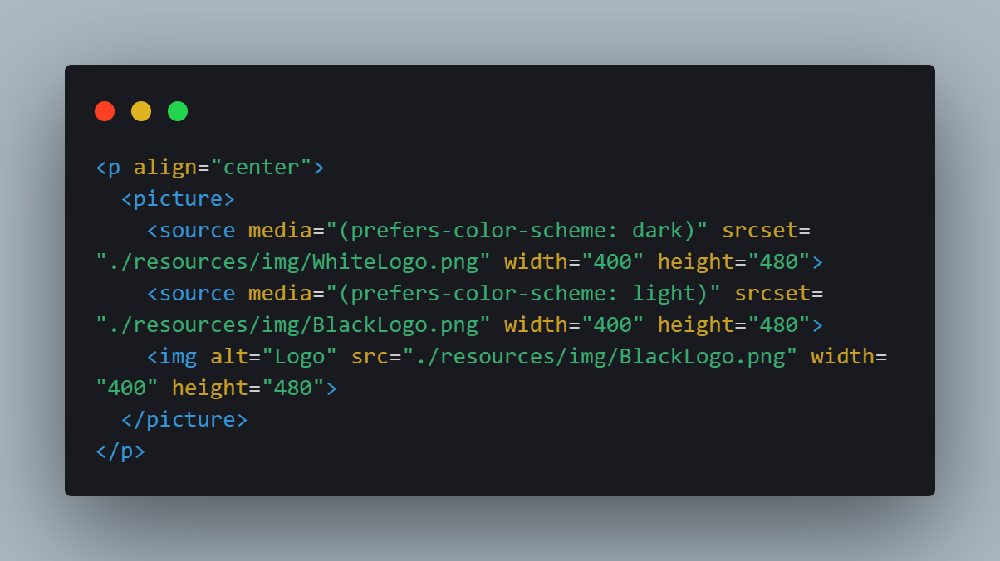

<!-- Responsive Logo -->

  <picture>
    <source media="(prefers-color-scheme: dark)" srcset="./resources/img/WhiteLogo.png" width="400" height="480">
    <source media="(prefers-color-scheme: light)" srcset="./resources/img/BlackLogo.png" width="400" height="480">
    
  </picture>

<!-- Badges -->

  
  
  

<!-- Short Description -->

Welcome to loBook, your all-in-one solution for customizing and organizing your book collection! loBook is an intuitive software crafted to elevate the reading experience for each user. Emulating a library environment, it effortlessly streamlines the management of your books.

<!-- Quick Links -->

  <a href="techStack">Tech Stack</a>
   • 
  <a href="features">Features</a>
   • 
  <a href="install">Install</a>

 

<!-- Showcase SECTION -->
<h2>Showcase</h2>

<!-- Tech SECTION -->
<h2 id="techStack">Tech Stack</h2>

The loBook tech stack combines <b>Laravel Breeze</b>, <b>React</b>, <b>PEST</b>, <b>MySQL</b>, <b>Node.js</b>, and <b>PHP</b>, collectively providing a comprehensive and robust solution for customizing and managing book collections.

<ul>
  <li><b>Laravel Breeze:</b> 
    handles user authentication and sets up the basic structure of the Laravel application.
  </li>
  <li><b>React:</b> 
    is utilized to develop the frontend (client-side) of the loBook application, providing a responsive and user-friendly interface for managing book collections.
  </li>
  <li><b>PEST:</b> 
    employed for testing various components of the PHP backend to ensure the reliability and functionality of the loBook software.
  </li>
  <li><b>MySQL:</b> 
   serves as the database management system for loBook, storing and organizing data related to book collections, user information, and other relevant data.
  </li>
  <li><b>Node.js:</b> 
    for server-side scripting and handling asynchronous tasks in the backend of the application.
   </li>
  <li><b>PHP:</b> 
    the primary server-side scripting language for the loBook application, handling the backend logic and communication with the database.
  </li>
</ul >

<!-- Features SECTION -->
<h2 id="features">Features</h2>

Quis tempor enim velit fugiat qui ullamco officia irure ullamco nostrud amet sint. Amet mollit velit voluptate id cupidatat aute enim laborum adipisicing. Laborum nisi duis et tempor ex anim. Tempor ad ullamco officia irure enim veniam ea magna ex incididunt.

<!-- Installation SECTION -->
<h2 id="install">Installation</h2>

Welcome to the installation guide for loBook. Follow these simple steps to get started with our project:

<ol>
  <li>Clone the repository: <b>https://github.com/mjbalcueva/loBook.git</b></li>
  <li>Using the terminal, install composer: <b>composer install</b></li>
  <li>Install the node depencies: <b>npm i</b></li>
  <li>Setup the .env variables</li>
  <li>Run table migrations using: <b>php artisan migrate</b></li>
  <li>Run the server: <b>php artisan serve</b> and <b>npm run dev</b></li>
</ol>